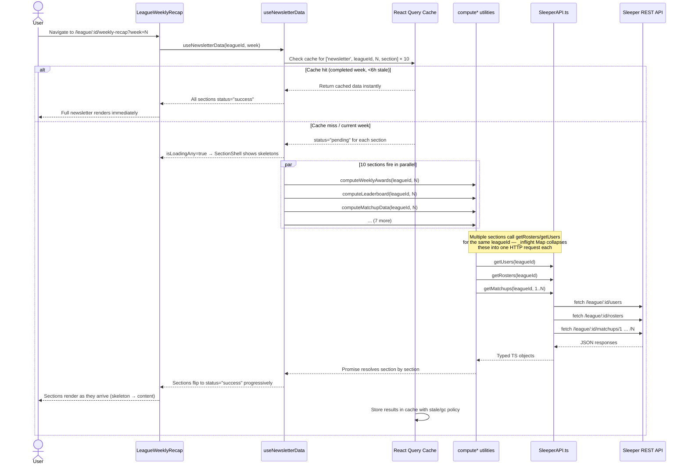

# Newsletter Data Flow

Visual overview of how data moves from the Sleeper API through the compute utilities and into the UI for the live newsletter (`LeagueWeeklyRecap`).

Related stories: Phase 7 (performance & caching), Phase 8 (testing & documentation).

---

## High-Level Architecture

```
┌─────────────────────────────────────────────────────────────────────┐
│                         Sleeper REST API                            │
│  /league  /rosters  /users  /matchups/<week>  /state/nfl           │
└──────────────────────────┬──────────────────────────────────────────┘
                           │  fetch (JSON)
                           ▼
┌─────────────────────────────────────────────────────────────────────┐
│                    SleeperAPI.ts                                     │
│  src/utils/api/SleeperAPI.ts                                        │
│                                                                     │
│  • Thin fetch wrappers (getLeague, getRosters, getUsers,            │
│    getMatchups, getNflState, …)                                      │
│  • Module-level _inflight Map: concurrent calls to the same URL     │
│    share one HTTP request (entry removed on settle)                 │
└──────────────────────────┬──────────────────────────────────────────┘
                           │  typed TS objects
                           ▼
┌─────────────────────────────────────────────────────────────────────┐
│              compute* utilities  (src/utils/newsletter/)            │
│                                                                     │
│  computeWeeklyAwards      → WeeklyAward[]                          │
│  computeLeaderboard       → LeaderboardData[]   (weeks 1–N)        │
│  computeStarters          → StartersData[]                         │
│  computeEfficiency        → EfficiencyData[]                       │
│  computeBestBall          → BestBallData[]                         │
│  computeMedian            → MedianData[]                           │
│  computePowerRankings     → PowerRankingsData[] (weeks 1–N)        │
│  computePlayoffStandings  → PlayoffTableData[]  (weeks 1–N)        │
│  computeSchedule          → ScheduleData        (weeks 1–N)        │
│  computeMatchupData       → MatchupData[]       (weeks 1–N)        │
└──────────────────────────┬──────────────────────────────────────────┘
                           │  Promise<T>
                           ▼
┌─────────────────────────────────────────────────────────────────────┐
│              useNewsletterData  (src/hooks/useNewsletterData.ts)    │
│                                                                     │
│  • useQueries — all 10 sections fetched in parallel                 │
│  • Intelligent cache policy per week type:                          │
│      completed week  → staleTime 6 h,  gcTime 24 h                 │
│      current week    → staleTime 1 h,  gcTime  2 h                 │
│  • Returns SectionResult<T> per section + aggregate helpers         │
│    (isLoadingAny, hasErrors, readySections, isMedianLeague)         │
│  • withPerfLogging wrapper: REACT_APP_NEWSLETTER_PERF=1 logs ms     │
└──────────────────────────┬──────────────────────────────────────────┘
                           │  NewsletterData
                           ▼
┌─────────────────────────────────────────────────────────────────────┐
│              LeagueWeeklyRecap  (src/pages/LeagueWeeklyRecap.tsx)  │
│                                                                     │
│  • Renders one SectionShell per section                             │
│  • SectionShell shows skeleton until status === "success"           │
│  • NewsletterErrorBoundary wraps each section independently         │
│  • Global toast fires when ≥2 sections error simultaneously         │
│  • Chart components (Victory.js) are React.lazy — loaded on demand  │
└─────────────────────────────────────────────────────────────────────┘
```

---

## Sequence: User Opens Week N Newsletter



---

## Cache Policy at a Glance

| Scenario | staleTime | gcTime | Refetch on mount | Refetch on focus |
|---|---|---|---|---|
| Completed week (week < current NFL week) | 6 hours | 24 hours | No | No |
| Current week (week ≥ current NFL week) | 1 hour | 2 hours | Yes | Yes |
| League settings (`getLeague`) | 24 hours | 24 hours | — | — |
| NFL state (`getNflState`) | 1 hour | 24 hours | — | — |

Query keys are scoped to `['newsletter', leagueId, week, section]` — switching leagues or weeks always fetches fresh data.

---

## Compute Utility Reference

Each utility is a pure async function: `(leagueId: string, week: number) → Promise<T>`.

| Utility | Output | Weeks fetched | Notes |
|---|---|---|---|
| [computeWeeklyAwards](../src/utils/newsletter/computeWeeklyAwards.ts) | `WeeklyAward[]` | current only | Uses `sleeperPlayers` for player photos; imports `calculateOptimalScore` from computeEfficiency |
| [computeLeaderboard](../src/utils/newsletter/computeLeaderboard.ts) | `LeaderboardData[]` | 1–N | Computes standings + previous-week rank for trend arrows; red/green heat-map colors on PF/PA |
| [computeStarters](../src/utils/newsletter/computeStarters.ts) | `StartersData[]` | current only | Uses `sleeperPlayers` for position lookup |
| [computeEfficiency](../src/utils/newsletter/computeEfficiency.ts) | `EfficiencyData[]` | current only | Exports `calculateOptimalScore` (best-ball optimal lineup) — reused by awards and best-ball |
| [computeBestBall](../src/utils/newsletter/computeBestBall.ts) | `BestBallData[]` | current only | Compares actual lineup to optimal; uses `calculateOptimalScore` from computeEfficiency |
| [computeMedian](../src/utils/newsletter/computeMedian.ts) | `MedianData[]` | current only | Only meaningful for leagues with `league_average_match === 1` (`isMedianLeague` flag) |
| [computePowerRankings](../src/utils/newsletter/computePowerRankings.ts) | `PowerRankingsData[]` | 1–N | Rolling weighted score across all weeks |
| [computePlayoffStandings](../src/utils/newsletter/computePlayoffStandings.ts) | `PlayoffTableData[]` | 1–N | Projects playoff seeding from current standings |
| [computeSchedule](../src/utils/newsletter/computeSchedule.ts) | `ScheduleData` | 1–N | Hypothetical records vs every other team's schedule (luck index) |
| [computeMatchupData](../src/utils/newsletter/computeMatchupData.ts) | `MatchupData[]` | 1–N | Powers scoring distribution histogram, weekly stats chart, margin-of-victory table |

---

## Error Handling

Each section is wrapped in `NewsletterErrorBoundary` (class component) with `resetKeys={[leagueId, week, sectionKey]}`. Navigating to a different week auto-resets error state without a full page reload.

When ≥2 sections error simultaneously, `LeagueWeeklyRecap` shows a fixed-position toast (implemented with `useState` + `useRef` timer to auto-dismiss).

Centralized error logging: `logNewsletterError` in [src/utils/logger/newsletterError.ts](../src/utils/logger/newsletterError.ts) — swap the `console.error` call for `Sentry.captureException` when Sentry is added.

---

## Environment Variables

| Variable | Effect |
|---|---|
| `REACT_APP_NEWSLETTER_PERF=1` | Logs per-section compute time to console. Sections >200ms emit `console.warn`. Enable with `REACT_APP_NEWSLETTER_PERF=1 pnpm start`. |

---

## Running Tests

```bash
# All tests
pnpm test

# Newsletter utilities only
pnpm test-utils-newsletter
```

Test files: [src/utils/newsletter/\_\_tests\_\_/](../src/utils/newsletter/__tests__/)
Fixtures: [src/utils/newsletter/testFixtures/sleeperFixtures.ts](../src/utils/newsletter/testFixtures/sleeperFixtures.ts)
(Fixtures live outside `__tests__/` so Jest doesn't treat them as test suites.)
